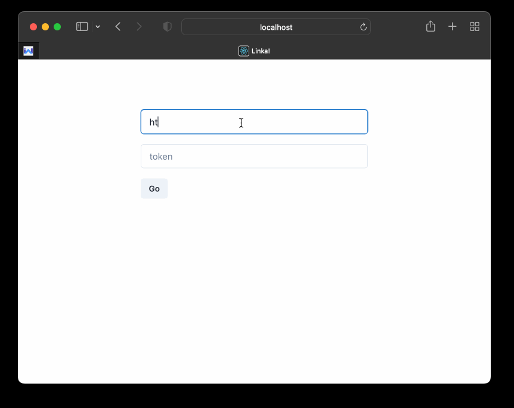

# Linka!

A smooth linkding quick search app.

## Features

- full text search
- multi keywords, substract keywords support
- instantly open search results
- search on type
- dark/light mode
- hotkeys

## Demo

[Linka! demo web app](https://linka.unoiou.com)

- `demo linkding base url`: https://link.unoiou.com
- `demo token`(restricted): `a6816f654f87197545cd66bfd2f8e294c40f1ee4`

## How-To

- type any keywords, seperated by space, results will be **intersection**
- use keywords start with `!` to **exclude**
- type `Enter` to open search results in new tabs

### Hotkeys

- `cmd+l` or `ctrl+l` to focus on the search box

## Development Prerequisite

Install `nodejs` and `yarn`, then run `yarn install` & `yarn start` to start up.

## Backend Prerequisite

- Enable `CORS` in backend by adding following headers to response:
  - `Access-Control-Allow-Origin: *`
  - `Access-Control-Allow-Methods: GET,POST,OPTIONS,PUT,DELETE`
  - `Access-Control-Allow-Headers: *`
  - `Access-Control-Max-Age: 1000000`
